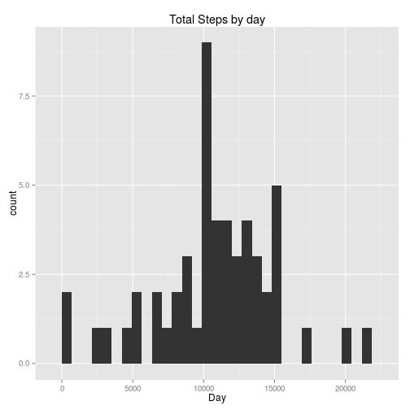
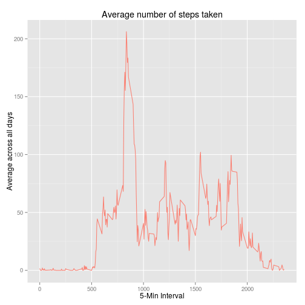
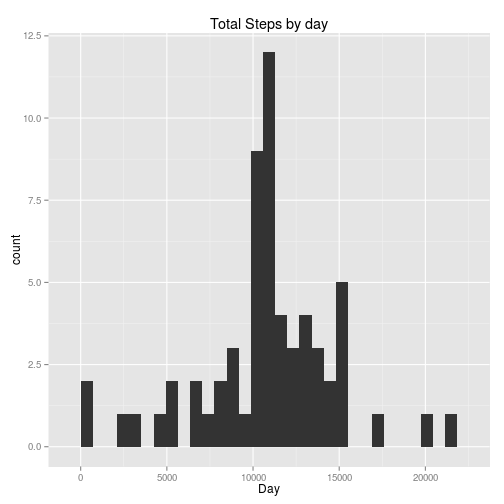
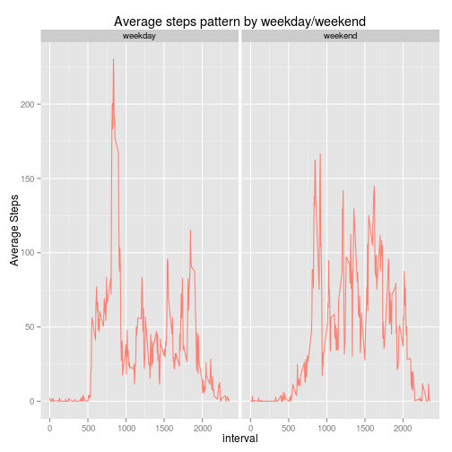

## Loading and preprocessing the data

1. Load the the data into R.


```r
ActivityData = read.csv("activity.csv", colClasses = c("numeric", "character", "numeric"))
```

2. Check and transform the data into a format suitable for the analysis

- Checking the data load 

```r
head(ActivityData, 3)
```

```
##   steps       date interval
## 1    NA 2012-10-01        0
## 2    NA 2012-10-01        5
## 3    NA 2012-10-01       10
```

```r
tail(ActivityData, 3)
```

```
##       steps       date interval
## 17566    NA 2012-11-30     2345
## 17567    NA 2012-11-30     2350
## 17568    NA 2012-11-30     2355
```

- Checking the data structure


```r
str(ActivityData)
```

```
## 'data.frame':	17568 obs. of  3 variables:
##  $ steps   : num  NA NA NA NA NA NA NA NA NA NA ...
##  $ date    : chr  "2012-10-01" "2012-10-01" "2012-10-01" "2012-10-01" ...
##  $ interval: num  0 5 10 15 20 25 30 35 40 45 ...
```

- Summary of the data


```r
summary(ActivityData)
```

```
##      steps            date              interval     
##  Min.   :  0.00   Length:17568       Min.   :   0.0  
##  1st Qu.:  0.00   Class :character   1st Qu.: 588.8  
##  Median :  0.00   Mode  :character   Median :1177.5  
##  Mean   : 37.38                      Mean   :1177.5  
##  3rd Qu.: 12.00                      3rd Qu.:1766.2  
##  Max.   :806.00                      Max.   :2355.0  
##  NA's   :2304
```

3. Transform the data


```r
ActivityData$date = as.Date(ActivityData$date, "%Y-%m-%d")
good =complete.cases(ActivityData)
ActivityData = ActivityData[good,]
```


## What is mean total number of steps taken per day?

1. Calculating the total number of steps taken per day


```r
library(ggplot2)

StepsDat = as.data.frame(sapply(split(ActivityData$steps, ActivityData$date), sum, na.rm=TRUE))
p = ggplot(StepsDat, aes(x=StepsDat[,1]))
p + geom_histogram() + labs(title= 'Total Steps by day') + xlab('Day') 
```

 

2. alculating and reporting the mean and median of the total number of steps taken per day


```r
mean(StepsDat[,1])
```

```
## [1] 10766.19
```

```r
median(StepsDat[,1])
```

```
## [1] 10765
```

## What is the average daily activity pattern?

1. Making a time series plot of the 5-minute interval (x-axis) and the average number of steps taken, averaged across all days (y-axis)


```r
library(ggplot2)
ts_Steps = sapply(split(ActivityData$steps, ActivityData$interval), mean, na.rm=TRUE)
ts_StepsDat = data.frame(days=as.numeric(names(ts_Steps)),ts_Steps) 
p = ggplot(ts_StepsDat, aes(x=days, y=ts_Steps))
p + geom_line(col='salmon')+labs(title='Average number of steps taken') +xlab('5-Min Interval') +ylab('Average across all days')
```

 

2. Which 5-minute interval, on average across all the days in the dataset, contains the maximum number of steps?

```r
Max.Interval = which.max(ts_Steps)
names(Max.Interval)
```

```
## [1] "835"
```

## Imputing missing values

1. Calculating and reporting the total number of missing values in the dataset


```r
sum(!complete.cases(ActivityData))
```

```
## [1] 2304
```

2. Devising a strategy for filling in all of the missing values in the dataset.

```r
AvgSteps = sapply(split(ActivityData$steps, ActivityData$interval), mean, na.rm=TRUE)
AvgSteps = data.frame(interval=as.numeric(names(AvgSteps)),AvgSteps) 

ActivityData = merge(ActivityData,AvgSteps, by = "interval")
NAs = is.na(ActivityData$steps)
ActivityData$steps[NAs] = ActivityData$AvgSteps[NAs]
```

3. Creating a new dataset that is equal to the original dataset but with the missing data filled in.


```r
ActivityDataNew = ActivityData[,c(1:3)]
head(ActivityDataNew)
```

```
##   interval    steps       date
## 1        0 1.716981 2012-10-01
## 2        0 0.000000 2012-11-23
## 3        0 0.000000 2012-10-28
## 4        0 0.000000 2012-11-06
## 5        0 0.000000 2012-11-24
## 6        0 0.000000 2012-11-15
```

```r
tail(ActivityDataNew)
```

```
##       interval    steps       date
## 17563     2355 0.000000 2012-10-16
## 17564     2355 0.000000 2012-10-07
## 17565     2355 0.000000 2012-10-25
## 17566     2355 0.000000 2012-11-03
## 17567     2355 1.075472 2012-10-08
## 17568     2355 1.075472 2012-11-30
```
4. Making a histogram of the total number of steps taken each day and Calculating and reporting the mean and median total number of steps taken per day. 

```r
library(ggplot2)
StepsNewTot = sapply(split(ActivityDataNew$steps, ActivityDataNew$date), sum)
StepsNewDat = data.frame(StepsNewTot)

p <- ggplot(StepsNewDat, aes(x=StepsNewDat[,1]))
p + geom_histogram() + labs(title= 'Total Steps by day') + xlab('Day') 
```

 


```r
mean(StepsNewTot)
```

```
## [1] 10766.19
```

```r
median(StepsNewTot)
```

```
## [1] 10766.19
```

## Are there differences in activity patterns between weekdays and weekends?

1. Creating a new factor variable in the dataset with two levels – “weekday” and “weekend” indicating whether a given date is a weekday or weekend day. 


```r
ActivityDataNew$date = as.Date(ActivityDataNew$date, format ='%Y-%m-%d')
ActivityDataNew$day =  ifelse(weekdays(ActivityDataNew$date) %in% c("sábado", "domingo"),'weekend','weekday')

StepsIntDay = aggregate(steps~ interval+day,ActivityDataNew,FUN="mean") 
```
2. Making a panel plot containing a time series plot of the 5-minute interval and the average number of steps taken, averaged across all weekday days or weekend days.


```r
library(ggplot2)
p = ggplot(StepsIntDay, aes(x=interval,y=steps)) 
p + geom_line(col='salmon')+facet_grid(.~day)+ylab('Average Steps')+labs(title='Average steps pattern by weekday/weekend')
```

 


